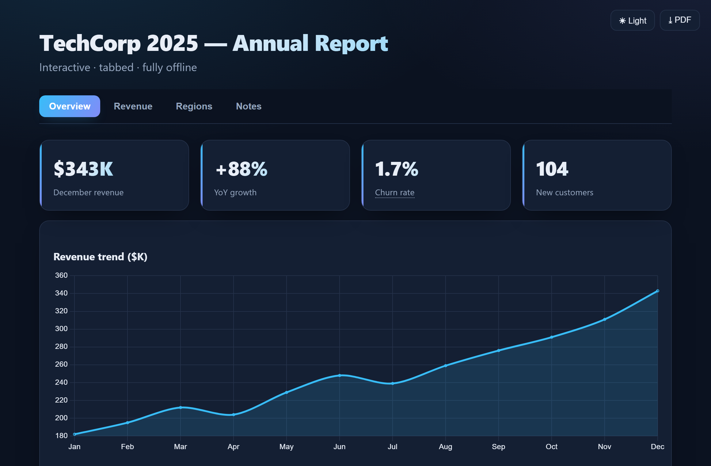

# present — Claude Code plugin

<p align="center">
  <a href="https://github.com/yudhvirc/claude-present-plugin/releases"></a>
  <a href="LICENSE"></a>
  
  
  
</p>

Turn **data files, code/architecture, logs, or a plain-text description** into a **self-contained HTML visual** — charts, diagrams, a keyboard-navigable PPT-style presentation, or a general HTML page. Local-first: bundles Chart.js + Mermaid so output works fully offline.

## What it does
Invoke the skill and describe (or point at) what you want to present:
- **Data → charts** — CSV/JSON/TSV, and **Excel `.xlsx`** (via a bundled dependency-free extractor) → bar, line, pie, scatter, radar, stacked, mixed (Chart.js).
- **Code/architecture → diagrams** — flowcharts, dependency/module graphs, class, sequence, ER (Mermaid).
- **Logs / command output → summary dashboards.**
- **Free-form description → the fitting diagram or chart.**
- **"Make a deck / slides / presentation"** → a self-contained HTML presentation with arrow-key navigation, Prev/Next buttons, progress bar, fullscreen (F), speaker notes (S), an overview grid (Esc), and charts embedded on slides.
- **"Build an HTML page/landing page/one-pager about X"** → Claude generates the content from your instructions and renders a general self-contained HTML page (`page.html`) — theme toggle + PDF export included.
- **"Make a report"** → a single-page **interactive** report (`report.html`) with **tabbed sections**, hover **tooltips**, KPI cards, charts, and diagrams.

Default output is **one self-contained, fully-offline `.html` file** — Chart.js and Mermaid are inlined, so nothing loads from the network. Ask for **CDN** if you'd rather have a smaller file, or for **Mermaid text** / **SVG** when you need those instead. Every run is written into an organized `present-output/<slug>/` folder (with an `index.html` landing page when there are multiple artifacts).

## Preview
Real, self-contained, fully-offline HTML output from `/present`:

**Data → charts** (built from an Excel workbook, with a light/dark toggle + PDF export)


**Interactive report** — tabbed sections, hover tooltips, KPI cards, charts & diagrams (one self-contained page)


**Presentation** — keyboard-navigable deck (arrows, fullscreen, speaker notes, PDF)


**HTML page** — generated from a one-line instruction


## 🚀 Installation

> **Requirements:** [Claude Code](https://docs.anthropic.com/en/docs/claude-code) · **zero runtime dependencies** — generated HTML opens in any browser, 100% offline.

**Paste these three lines into Claude Code** — add the marketplace, install, reload:

```shell
/plugin marketplace add yudhvirc/claude-present-plugin
/plugin install present@present
/reload-plugins
```

✅ **That's it.** Run `/plugin list` — you'll see **`present@present`**. Now just ask: _"present sales.csv as a bar chart."_

> 💡 **`present@present`** = plugin **present** from marketplace **present**. Update anytime with `/plugin marketplace update present`.

<details>
<summary>👥 <b>Team / project install</b> — share with everyone on a repo</summary>

<br>Commit this to the project's `.claude/settings.json`:

```json
{
  "extraKnownMarketplaces": {
    "present": { "source": { "source": "github", "repo": "yudhvirc/claude-present-plugin" } }
  },
  "enabledPlugins": { "present@present": true }
}
```
</details>

<details>
<summary>🛠️ <b>Developer / local install</b> — from a cloned folder</summary>

<br>

```bash
git clone https://github.com/yudhvirc/claude-present-plugin.git
```
```shell
/plugin marketplace add /absolute/path/to/claude-present-plugin
/plugin install present@present
/reload-plugins
```
</details>

<details>
<summary>🔎 <b>Verify &amp; manage</b></summary>

<br>

```shell
/plugin list               # should list present@present
/plugin details present
/plugin disable present    # or: /plugin enable present
```
</details>

<details>
<summary>⚠️ <b>Troubleshooting</b> — "Marketplace present not found"</summary>

<br>You must **add** the marketplace *before* installing (this error means the `add` step never registered). Add it first and confirm it appears:

```shell
/plugin marketplace add yudhvirc/claude-present-plugin
/plugin marketplace list          # should show: present
/plugin install present@present
```
If a stale entry is stuck, remove it and re-add:
```shell
/plugin marketplace remove present
/plugin marketplace add yudhvirc/claude-present-plugin
```
</details>

## Usage
The skill **auto-activates** when you ask for something visual — just describe what you want:
- "present sales.csv as a bar chart of revenue by region"
- "diagram the architecture of the src/ folder"
- "make a 6-slide deck from these Q3 numbers with a revenue chart"
- "build an HTML landing page for a coffee subscription"

You can also invoke it explicitly: `/present:present`.

By default it produces a **fully-offline** self-contained HTML file (Chart.js + Mermaid inlined) and adds diagrams where they aid understanding. It can also emit **Mermaid text** or **SVG**, or use CDN for a smaller file if you ask — then it writes the result into an organized `present-output/<slug>/` folder.

## Structure
```
.claude-plugin/marketplace.json     Marketplace listing (enables /plugin install)
plugins/present/                    The plugin (source: ./plugins/present)
  .claude-plugin/plugin.json        Plugin manifest
  skills/present/
    SKILL.md                        Skill instructions (workflow)
    references/authoring.md         How to fill templates + chart/diagram recipes
    assets/templates/               chart.html · diagram.html · slides.html · page.html · report.html
    assets/lib/                     Bundled Chart.js + Mermaid (offline)
    assets/scripts/xlsx-to-json.ps1 Dependency-free .xlsx → JSON/CSV extractor (PowerShell)
    assets/scripts/xlsx-to-json.js  Dependency-free .xlsx → JSON/CSV extractor (Node.js)
    assets/scripts/build.js         Deterministic assembler + validator (--check) for generated HTML
examples/                           Sample inputs + generated outputs
```

## License
MIT — see [LICENSE](LICENSE). Bundles Chart.js and Mermaid (both MIT).
